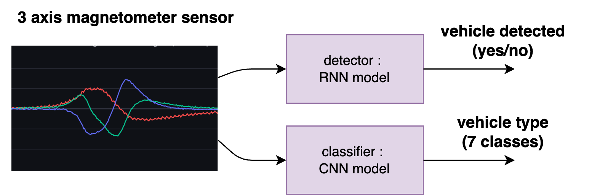
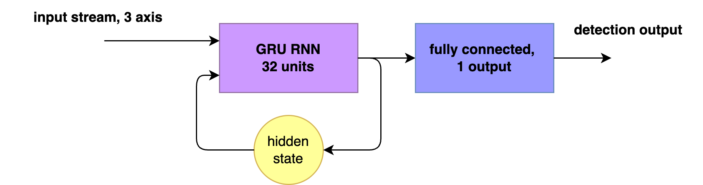
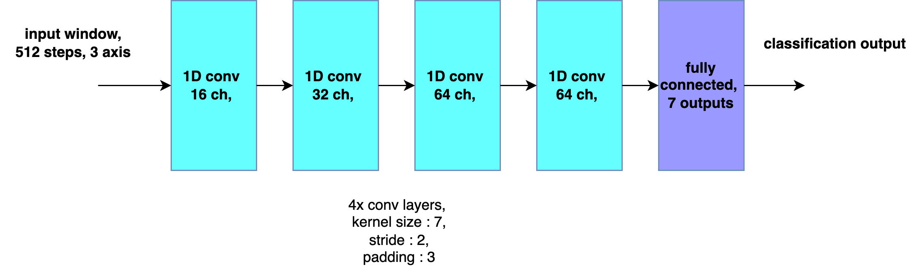
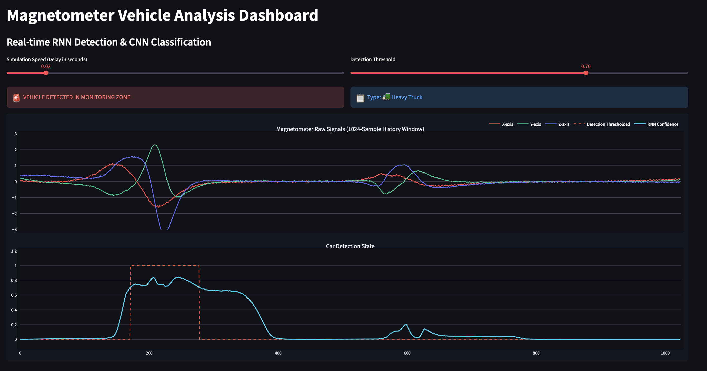

# Vehicle Detection & Classification using 3-Axis Magnetometers

An end-to-end, real-time embedded machine learning pipeline that detects and classifies vehicles using 3-axis magnetic field sensor data. The project splits the workload into an ultra-lightweight **RNN Detector** for real-time edge triggering, and a deep **1D-CNN Classifier** for complex vehicle categorization.

This architecture is optimized to run on low-power, edge-hardware like an ARM Cortex-M4 MCU.

---

## 🚀 System Architecture & Working Principle

The system continuously processes an incoming stream of 3-axis magnetometer readings ($X, Y, Z$) sampled at **100 Hz**. Because running a heavy classifier continuously on edge hardware is computationally expensive, the system uses a dual-stage architecture:

1. **Real-time Detector (RNN):** A tiny Recurrent Neural Network monitors the live data stream step-by-step. It makes low-latency binary decisions (Vehicle Present vs. No Vehicle).
2. **Window Extraction:** When a vehicle event is detected, the pipeline extracts a **512-sample window**, centered precisely around the detector's maximum signal amplitude.
3. **Deep Classifier (1D-CNN):** Once the window is locked, a larger 1D Convolutional Neural Network processes the full 512-sample waveform. Since vehicle events happen sporadically, we have plenty of processing overhead to run a larger model for accurate multi-class classification.

---

## 📊 Dataset & Core Challenges

### The Dataset
The models were validated using a real-world dataset collected from MEMS-based magnetic sensor systems. 
* **Source Publication:** [*Efficient Dataset Creation for MEMS-Based Magnetic Sensor Systems in Intelligent Transportation Applications* (MDPI Sensors)](https://www.mdpi.com/1424-8220/25/24/7407) *(Note: I am not a co-author of this paper; their open-source data was utilized for training).*

### Challenges & Engineering Solutions

#### 1. Severe Class Imbalance
The data is heavily dominated by normal consumer cars, creating a massive representation risk for rare vehicles. The dataset maps to the following categories:
* `0`: ⚡ Motorcycle
* `1`: 🚗 Car
* `2`: 🚐 LGV (Light Goods Vehicle)
* `3`: 🚜 ORV (Off-Road Vehicle)
* `4`: 🚛 Heavy Truck
* `5`: ❓ Unknown
* `6`: 📦 Other

**Solution:** Implemented a custom software data balancer during the training pipeline initialization to prevent the models from defaulting to the majority class.

#### 2. Model Robustness & Domain Adaptation
To ensure the models generalized well to real-world variations (sensor misalignment, diverse vehicle speeds, environmental noise), a specialized **data augmentation pipeline** was designed:
* **Noise Injection:** Point-wise Gaussian noise + constant offset shifts.
* **Spatial Agnosticism:** Random 3-axis permutation and random axis flipping.
* **Kinematic Invariance:** Random signal amplitude scaling and shifting to mimic various speeds and vehicle paths.

---

## 🛠️ Model Breakdown & Micro-Benchmarking

### 1. The Detector (Edge Optimized)
* **Architecture:** A tiny Gated Recurrent Unit (GRU) featuring just **32 hidden units**, paired with a single-unit dense linear layer.
* **Target Hardware:** 120MHz ARM Cortex-M4 MCU.

#### Performance Metrics
* **Accuracy:** 95.53%
* **F1-Score:** 0.8536
* **Intersection over Union (IoU):** 0.7446

#### Edge Execution Latency Benchmarks
| Metric / Slice | Inference Duration |
| :--- | :--- |
| **Mean Latency** | 116 µs (0.000116 sec) |
| **Standard Deviation ($\sigma$)** | 9 µs |
| **95th Percentile (P95)** | 124 µs |
| **Worst-Case Peak Outlier** | 612 µs |

#### Binary Confusion Matrix
| True Positive (TP) | True Negative (TN) | False Positive (FP) | False Negative (FN) |
| :---: | :---: | :---: | :---: |
| 666,831 | 4,224,490 | 96,738 | 131,941 |

---

### 2. The Classifier (Deep 1D-CNN)
* **Architecture:** 4-Layer 1D Convolutional Neural Network.
* **Input Size:** 512-sample fixed window.
* **Design Philosophy:** Captures wider spatial context across the entire waveform pass. Since it triggers strictly per-event, it trades stream-speed for top-tier feature classification.

#### Global Summary Performance
* **Micro Accuracy:** 86.04%
* **Macro Balanced Accuracy:** 82.45%
* **Macro Recall Average:** 67.14%

#### Per-Class Metric Arrays
| Class ID / Vehicle Type | Precision | Recall | F1-Score | Isolated Class Accuracy |
| :--- | :---: | :---: | :---: | :---: |
| **0: ⚡ Motorcycle** | 0.16228 | 0.90244 | 0.27509 | 0.98050 |
| **1: 🚗 Car** | 0.99081 | 0.83632 | 0.90703 | 0.88510 |
| **2: 🚐 LGV** | 0.24051 | 0.84758 | 0.37469 | 0.92390 |
| **3: 🚜 ORV** | 0.22823 | 0.42458 | 0.29688 | 0.96400 |
| **4: 🚛 Heavy Truck** | 0.58586 | 0.72956 | 0.64986 | 0.98750 |
| **5: ❓ Unknown** | 0.00000 | 0.00000 | 0.00000 | 1.00000 |
| **6: 📦 Other** | 0.96434 | 0.95925 | 0.96179 | 0.97980 |

#### Inference Latency Profile
| Statistical Slice | Latency |
| :--- | :--- |
| **Mean Latency per Sample** | 137 µs (0.000137 sec) |
| **95th Percentile (P95)** | 143 µs |
| **Maximum Outlier Peak** | 7.11 ms |

---

## 💻 Streamlit Web Application Demo

To interact with the models visually, a Streamlit evaluation interface was built. It allows developers to inspect individual sensor event waveforms, track live stream predictions, and inspect prediction certainties in real time.

*Figure: Live demo dashboard showing a `wave_detail.png` vehicle event window extraction alongside classification scores.*

---