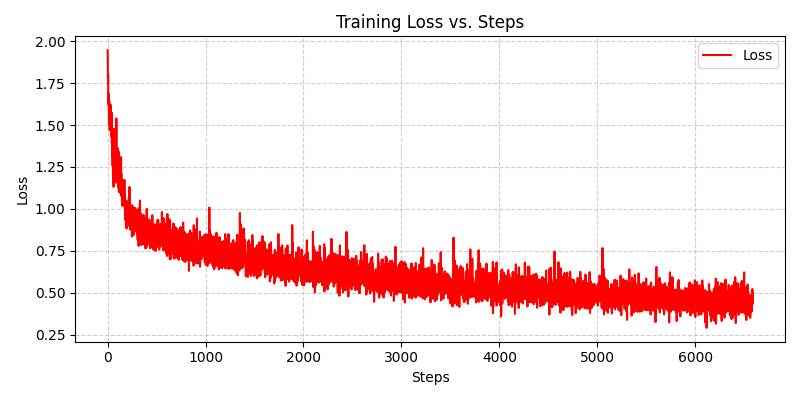
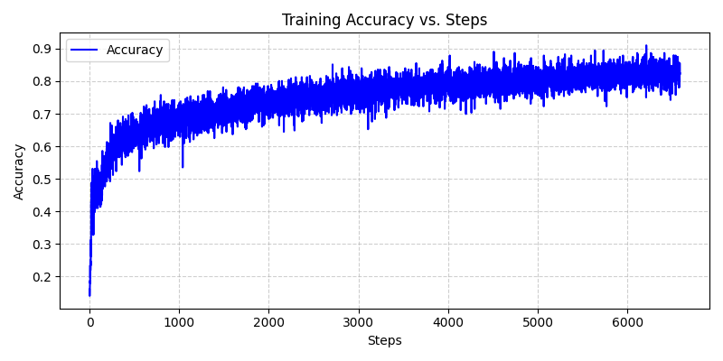
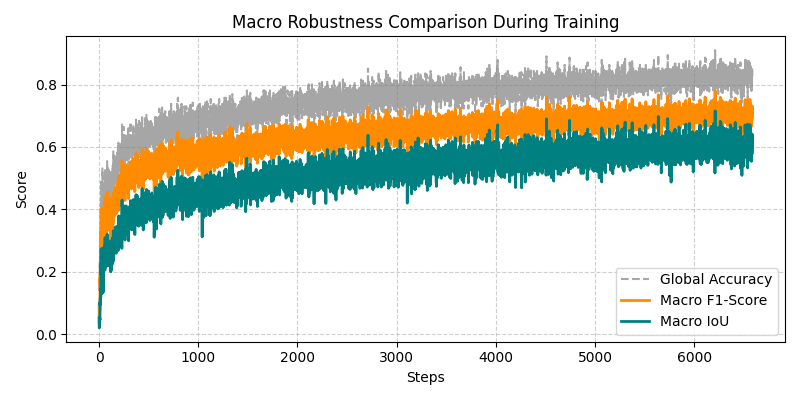
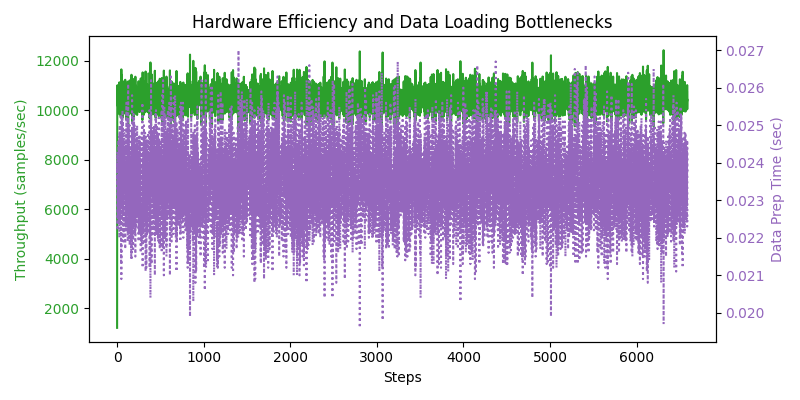
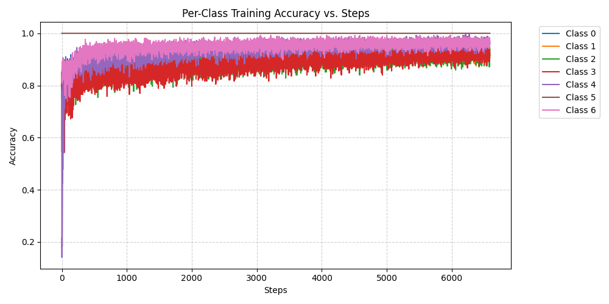
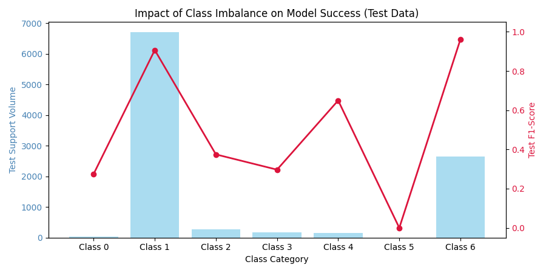

# Comprehensive Performance & Execution Report

## 1. Training Progression Evaluation
- **Total Training Steps Tracked**: 6587
- **Final Training Loss**: 0.494712
- **Final Global Training Accuracy**: 0.824220
- **Final Macro F1-Score**: 0.702380
- **Final Macro IoU**: 0.602140

### Training Progress Visualizations
#### Global Loss & Accuracy History
 

#### Macro Metric Robustness & Hardware Profiles
 

#### Per-Class Base Line Accuracy Shifts

## 2. Final Test Evaluation Summary
### Cross-Class Imbalance Risk Overview

### Global Summary Test Metrics
| Global Performance Field | Log Value |
| :--- | :---: |
| **Total Test Samples Pool** | 10000 |
| **Micro Accuracy Score** | 0.86040 |
| **Global Intersection over Union (mIoU)** | 0.40027 |
| **Global Dice/F1 Score** | 0.49505 |
| **Macro Precision Average** | 0.45315 |
| **Macro Recall Average** | 0.67139 |
| **Macro Specificity Average** | 0.97768 |
| **Macro Balanced Accuracy Score** | 0.82454 |
| **Macro Matthews Correlation Coefficient (MCC)** | 0.49625 |

### Prediction Entropy & Information Dynamics
| Certainty Classification Target Pool | Entropy Vector Score |
| :--- | :---: |
| **Global Mean Cross-Entropy** | 0.480269 |
| **Mean Entropy on Correct Predictions (High Certainty)** | 0.429212 |
| **Mean Entropy on Incorrect Predictions (Confused/Wrong)** | 0.794944 |

### Confusion Matrix (Per-Class Breakdown)
| Class Identifier | True Positive (TP) | True Negative (TN) | False Positive (FP) | False Negative (FN) | Total Ground Support |
| :--- | :---: | :---: | :---: | :---: | :---: |
| **Class 0** | 37 | 9768 | 191 | 4 | 41 |
| **Class 1** | 5605 | 3246 | 52 | 1097 | 6702 |
| **Class 2** | 228 | 9011 | 720 | 41 | 269 |
| **Class 3** | 76 | 9564 | 257 | 103 | 179 |
| **Class 4** | 116 | 9759 | 82 | 43 | 159 |
| **Class 5** | 0 | 10000 | 0 | 0 | 0 |
| **Class 6** | 2542 | 7256 | 94 | 108 | 2650 |

### Comprehensive Per-Class Metric Arrays
| Class Identifier | Precision | Recall / Sensitivity | F1-Score / Dice | Isolated Class Accuracy |
| :--- | :---: | :---: | :---: | :---: |
| **Class 0** | 0.16228 | 0.90244 | 0.27509 | 0.98050 |
| **Class 1** | 0.99081 | 0.83632 | 0.90703 | 0.88510 |
| **Class 2** | 0.24051 | 0.84758 | 0.37469 | 0.92390 |
| **Class 3** | 0.22823 | 0.42458 | 0.29688 | 0.96400 |
| **Class 4** | 0.58586 | 0.72956 | 0.64986 | 0.98750 |
| **Class 5** | 0.00000 | 0.00000 | 0.00000 | 1.00000 |
| **Class 6** | 0.96434 | 0.95925 | 0.96179 | 0.97980 |

### Test Inference Latency Profiles
| Statistical Distribution Slice | Execution Latency Target |
| :--- | :---: |
| **Mean Latency per Sample** | 0.000137 sec |
| **Standard Deviation ($\sigma$)** | 0.000070 sec |
| **68th Percentile (P68)** | 0.000136 sec |
| **95th Percentile (P95)** | 0.000143 sec |
| **99.7th Percentile (P99.7)** | 0.000147 sec |
| **Maximum Outlier Peak Latency** | 0.007116 sec |

