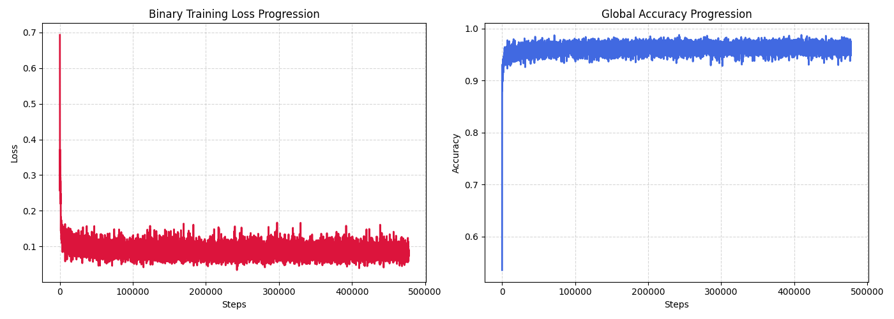
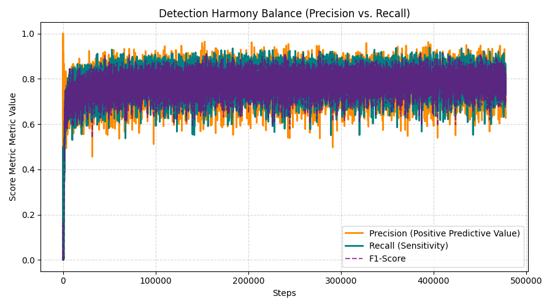
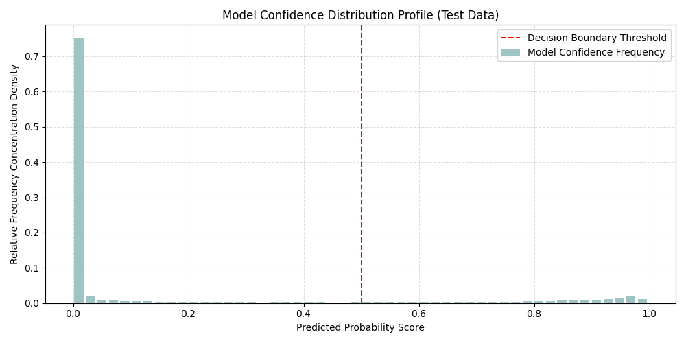

# Comprehensive Binary Detection Summary Performance Report

## 1. Production Training Analysis
- **Total System Evaluation Steps**: 477802
- **Final Optimization Step Loss Value**: 0.088493
- **Final Operational Tracking Accuracy**: 0.95877
- **Final Detection Core F1-Score**: 0.70662
- **Final Intersection over Union (IoU)**: 0.54634

### Training Progress Graphics
#### Loss & Basic Accuracy Curves

#### Detection Harmony Trade-off Curves

## 2. Definitive Test Matrix Evaluation Evaluation
### Definitive Test Benchmark Outputs
| Target Benchmark Domain Metric Field | Evaluated Metric Output Score |
| :--- | :---: |
| **Total Processed Test Instance Volumes** | 10,000 |
| **Global Boundary Binary Classification Accuracy** | 0.95534 |
| **Dice / F1 Evaluation Target Score Vector** | 0.85363 |
| **Intersection over Union (IoU) Detection Index** | 0.74464 |
| **Precision Index Performance** | 0.87331 |
| **Recall / True Positive Sensitivity Rate** | 0.83482 |
| **Specificity Index Value** | 0.97761 |
| **Balanced Accuracy Score Equation Average** | 0.90622 |
| **Matthews Correlation Coefficient (MCC)** | 998.06126 |

### Prediction Calibration & Score Distribution View Profiles

### Binary Confusion Matrix Counts Structure
| True Positive (TP) | True Negative (TN) | False Positive (FP) | False Negative (FN) | Decision Boundary |
| :---: | :---: | :---: | :---: | :---: |
| 666,831 | 4,224,490 | 96,738 | 131,941 | Threshold @ 0.5 |

### Batch Realtime Latency Execution Benchmarks
| Operational Percentile Slice | Sample Delay Profile Duration |
| :--- | :---: |
| **Average Inference Mean Delay** | 0.000116 sec |
| **Standard Deviation Profile Distribution Variance** | 0.000009 sec |
| **95th Percentile Execution Window Limit (P95)** | 0.000124 sec |
| **Worst-Case System Latency Peak Outlier (Max)** | 0.000612 sec |

